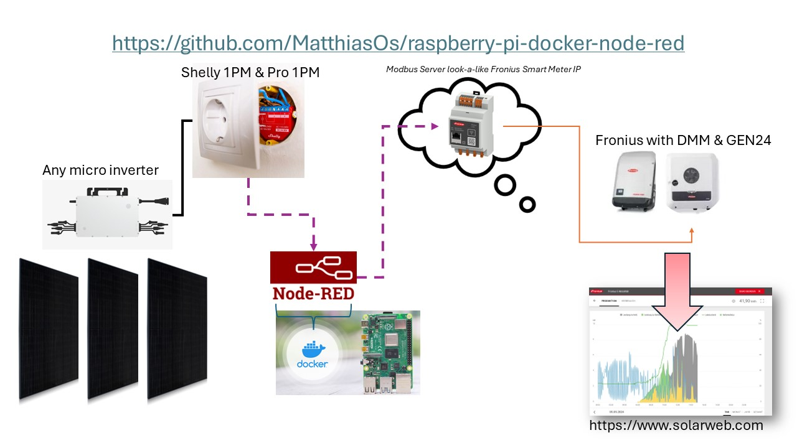
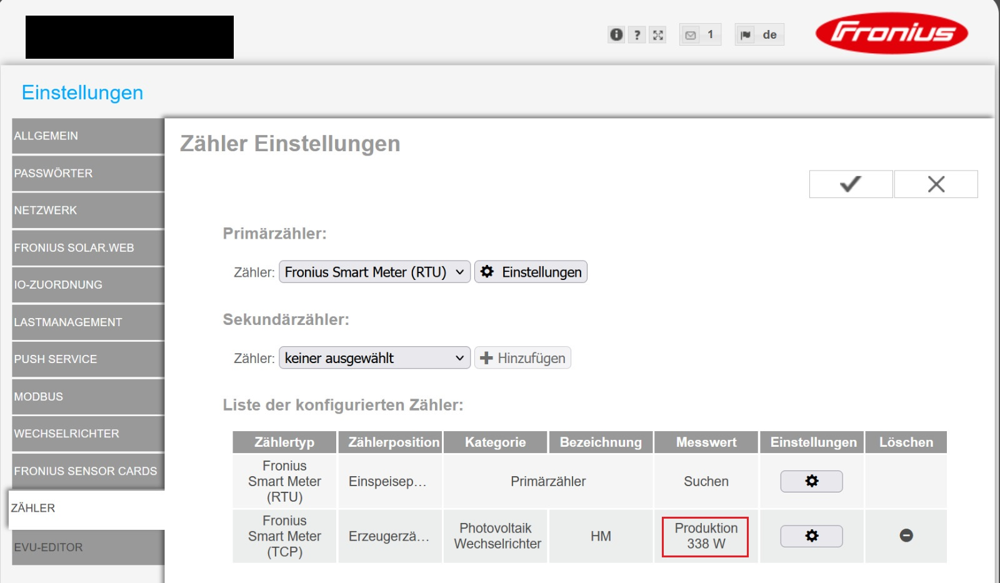
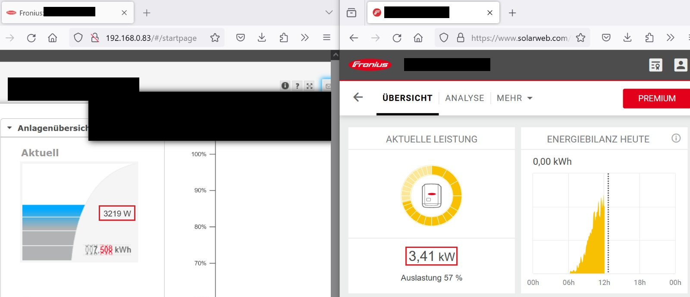

# Übersicht der Anwendungen:  


# Wie man ein RaspberryPi als Zähler (Erzeuger/Verbraucher) in Fornius über node-red einbindet

SD Karte mit `Raspberry Imager` flashen (SSH aktivieren), hier direkt ein WLAN angeben, welches man bei der weiteren Einrichtung verwenden will.
(Später kann man dann noch das WLAN einrichten, welches dann Vorort existiert).
Nach der Installation per SSH auf das PI verbinden

## Node-Red installieren: 
```
bash <(curl -sL https://raw.githubusercontent.com/node-red/linux-installers/master/deb/update-nodejs-and-nodered)
```
Auf die Frage `Install Pi specific nodes?` mit "N" antworten. (Das sind Nodes mit denen man Hardware, zB GPIO steuern kann)

Wenn `Node-RED Settings File initialisation` kommt, die Fragen beantworten.

Node-Red ist dann über den __Port 1880__ erreichbar: Beispiel: `http://192.168.178.44:1880`

Die Logs kann man über `node-red-log` sehen

### Starten nodered
```
 node-red-start
```
alternative
```
 systemctl enable nodered.service
```
to autostart Node-RED at every boot

### Ändern des Ports
Wenn man den standard Port ändern will muss man die `settings.js` editieren
```
nano ~/.node-red/settings.js
```
Folgende Zeile ggf einkommentieren und den Port anpassen:
```
uiPort: process.env.PORT || 1881,
```
Speichern und Schließen: STRG+X -> Y -> Enter
P

Port freigabe 502 über putty
```
sudo setcap 'cap_net_bind_service=+ep' /usr/bin/node
```
Node-Red neustarten
```
node-red-restart
```

## WLAN (optional)
Damit das RaspberryPi sich direkt mit dem WLAN am Ort wo man es verwenden will verbindet, muss man vorher die Verbindung [mit dem NetworkManager einrichten](https://raspberrytips.com/raspberry-pi-wifi-setup/#set-up-your-wifi-on-raspberry-pi-os-lite) einrichten:
```
sudo nmtui
```
(Manuell müsste es auch gehen, dann muss man eine "\<Wifi-Name\>.nmconnection" Datei anlegen, siehe https://forums.raspberrypi.com/viewtopic.php?t=360175)

# Dependecies in node-red Palette installieren
- [node-red-contrib-shelly](https://flows.nodered.org/node/node-red-contrib-shelly) zum Auslesen der PV Erzeugung von einem Shelly (nur benötigt für Variante 1)
- [node-red-contrib-modbus](https://flows.nodered.org/node/node-red-contrib-modbus) zum Schreiben der Daten mittels Modbus in den Fronius Wechselrichter
- [node-red-contrib-buffer-parser](https://flows.nodered.org/node/node-red-contrib-buffer-parser) zum einfachen Konvertieren von Registern zu lesbaren Werten und zurück (optional)

# Externen Zähler in Fronius einbinden
Damit im Fronius SolarWeb neben dem Fronius Wechselrichter auch ein externer Erzeuger (zB Variante 1) oder Verbraucher (zB Variante 2) berücksichtigt wird, muss man diese dem Fronius Wechselrichter als externen Energiezähler (GEN24) zugänglich machen.

Dazu wird ein ModbusTCP Server angelegt der den Energiezähler so simuliert, dass der Fronius Wechselrichter sich aus dem Register dieses Modbus Servers die Werte holen kann.
In die Register des Modbus Server muss man neben Standardwerte zur Identifikation als Energiezähler noch den benötigten `AC Power value (Total) [W]` des Erzeugers/Verbrauchers in die dafür vorgesehen Register schreiben.
Die Register Mappings können [hier von Fronius](https://www.fronius.com/QR-link/0006) runtergeladen werden, oder siehe im [Anhang](Meter_Register_Map_Float_v1.0.xlsx).
(Beachten ob im Fronius Wechselrichter "Float" oder "Int+SF" eingestellt ist!)

# Variante 1: externer Erzeuger (zB Balkonwechselrichter)
In node-red den [Flow](shelly_pv_erzeuger_flow.json) (angelehnt an diesen [flow aus dem node-red Forum](https://discourse.nodered.org/t/simulate-a-modbus-tcp-server-and-feed-registers/78763)) importieren.
Nach einem boot/deployment werden automatisch die einmalig benötigten Daten in den Modbus Server geschrieben.
Außerdem wird jede Sekunde beim Shelly die Erzeugungsdaten abgefragt und diese (muss negativ sein, da Erzeugung) in den Modbus Server geschrieben.
(Es stehen weitere lesende Operationen im flow bereit, diese werden aber für den Anwendungsfall nicht benötigt und sie nur zur Kontrolle da.)

## Nach dem Import des flows muss noch folgendes gemacht werden:
- Shelly IP Adresse im Node anpassen

# Variante 2: externer Verbraucher (zB Hardy Barth Ladepunkt)
In node-red den [Flow](hardy_barth_verbraucher_flow.json) (angelehnt an diesen [flow aus dem node-red Forum](https://discourse.nodered.org/t/simulate-a-modbus-tcp-server-and-feed-registers/78763)) importieren.
Nach einem boot/deployment werden automatisch die einmalig benötigten Daten in den Modbus Server geschrieben.
Außerdem wird jede Sekunde ein http request an die Ladesäule gesendet und die Verbrauchsdaten abgefragt und diese (muss positiv sein, da Verbrauch) in den Modbus Server geschrieben.
(Es stehen weitere lesende Operationen im flow bereit, diese werden aber für den Anwendungsfall nicht benötigt und sie nur zur Kontrolle da.)

## Nach dem Import des flows muss noch folgendes gemacht werden:
- http request Adresse im Node überprüfen, müsste aber generisch für Anwendungsfälle mit nur einem Ladepunkt so passen
- wenn die IP Adresse `http://ecb1.local` nicht aufgelöst werden kann, muss die tatsächliche IP der Ladestation eingetragen werden

# Anzeige im SolarWeb
Im Web Interface des Fronius Wechselrichters muss man nun noch den Modbus Server als Energiezähler hinzufügen:
- **RaspberryPi IP Adresse** mit **Port 502** und **UnitID 3**
  


Anschließend kann man den Unterschied zwischen SolarWeb und dem Fronius Wechselrichter sehen.
In dem Fall, wurde ein PV-Erzeuger (Variante 1) eingebunden:


# WORK IN PROGRESS: Nice to have
## Reboot/Shutdown über node-red
Damit man das Raspberry Pi über node-red neustarten und ausschalten kann, muss man den [Flow](shutdown_reboot_flow.json) importieren.
